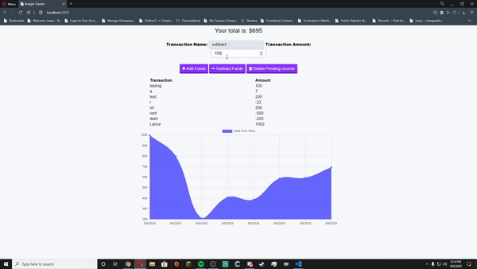

# PWA Budget Tracker

- Track your budget online or offline

---

## Table of Contents

- [Installation](#installation)
- [Start](#start)
- [Usage](#usage)
- [Contributors](#contributors)
- [Questions](#questions)
- [License](#license)

---

## Installation

- To install necessary dependencies, run the following command:

```
  npm i
```

---
## Start

- To run the app, run the following command:

```
  npm start
```

---

## Usage

- Contact my team members easily.
  ### User Story

```
  AS an Adult

  I WANT a Budget Tracker

  SO THAT I can track my money easily.
```

## 

## Contributors

- Lance Page

---

## Questions

---

## License

## [](https://opensource.org/licenses/ISC)